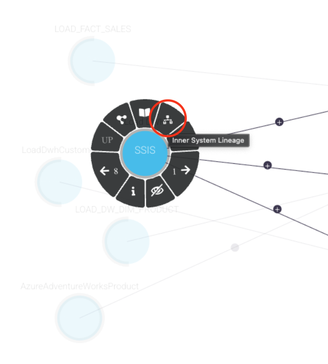
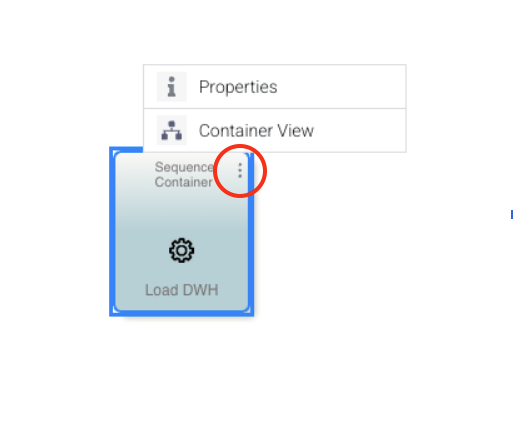
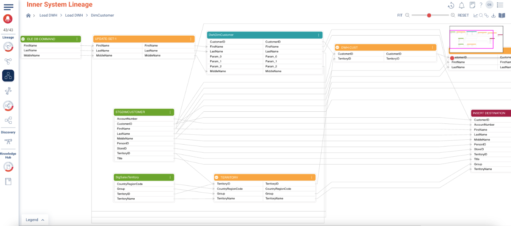
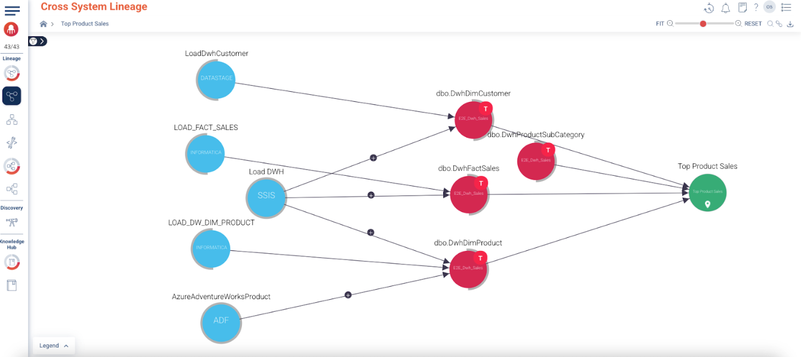
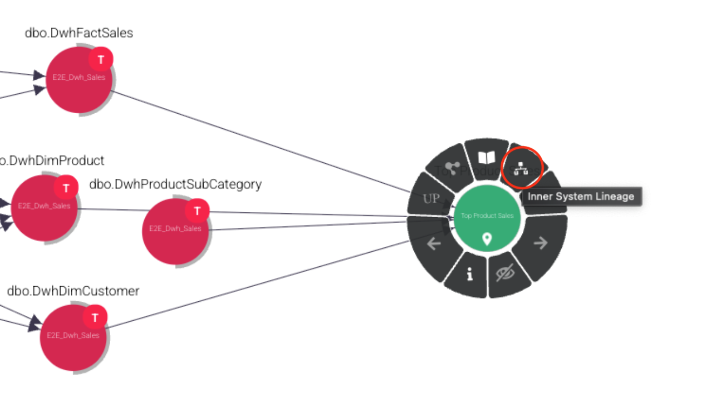
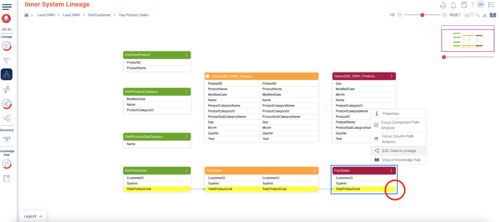

### Inner System Lineage

Before debugging the Total Product Cost problem, let's first do a quick exercise to understand what is Inner System Lineage and how it looks different for each type of system in Octopai.

1. Now in order to move to the **Inner-System Lineage** view, we will drill down into **SSIS** ETL named **Load DWH** by clicking on its blue circle and selecting the “Inner System Lineage” icon.

2. The Sequence Container of the SSIS ETL will appear. Please note that this “Inner System Lineage” view is different for each type of ETL system/level to reflect its nature. For **SSIS (SQL Server Integration Services)**, it’s a sequence of tasks being executed in a specific order.

3. Click on the three dots of the Sequence Container and choose **“Container View”**.

4. Repeat the same with the **“Dim Customer”** task and choose **“Inner System Lineage”**.

5. Note how the view changed to reflect what transformations the task is doing, including sources and destinations.

Now let's go back to tackle our main problem with Total Product Cost column.

6. Use your browser back button to go back to the Cross System Lineage view.

7. This time we will show the Inner System Lineage of the Report by clicking on the green circle then the inner lineage icon as in the screenshot below. Again, notice how the view will be different for a report.

