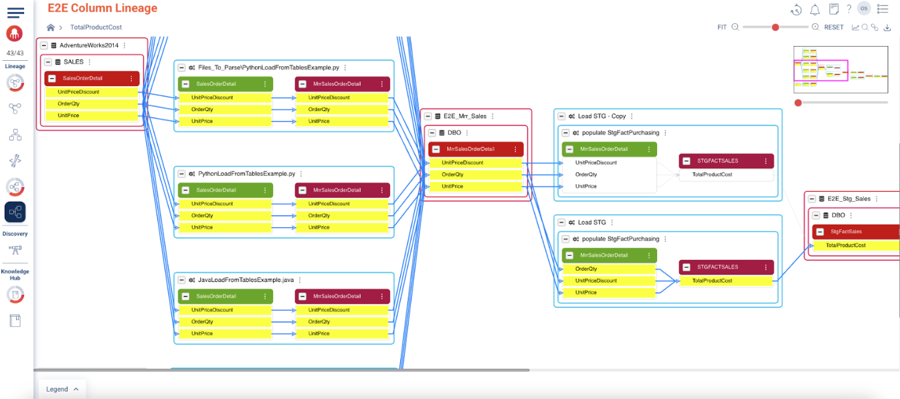
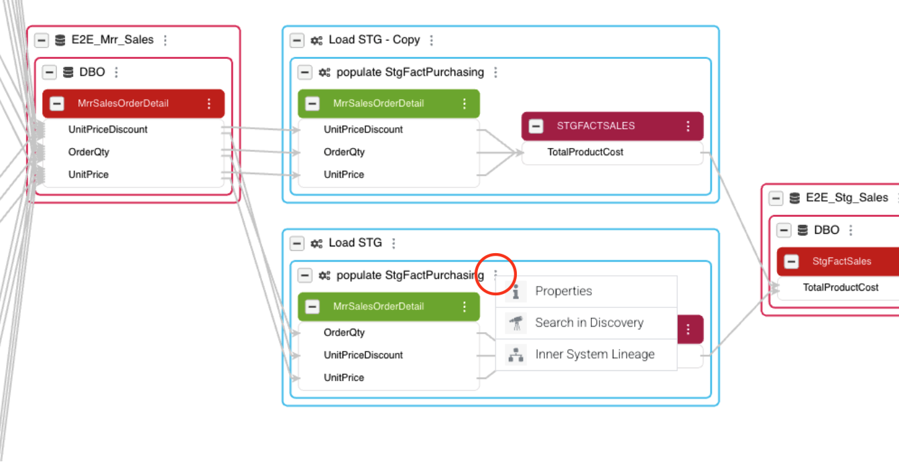

### End-to-End Column Lineage

Now is the time to start debugging the error our CEO is seeing in this report. We will achieve this by tracing the single “Total Product Cost” column back to how it was calculated.

1. Start by hovering on **TotalProductCost** in the **FactSales** table (coded in red) and clicking the three dots beside it. Once clicked, you will find its source fields highlighted in yellow.
2. Select **E2E Column Lineage**

In the E2E lineage view below, notice how it illustrates the end-to-end lineage for the "TotalProductCost" column. Starting from the original source tables in the AdventureWorks2014 database, the data flows through multiple transformation stages involving Python, Java, and parsing processes. It then passes through intermediate tables like E2E_Mrr_Sales and STGFACTSALES, undergoing further transformations until it finally populates the "TotalProductCost" column in the target staging area.

If you look closely at the middle light blue ETL processes, you will find that this is the first time where TotalProductCost value was actually calculated using those three columns from E2E_Mrr_Sales table: UnitProductDiscount, OrderQty and UnitPrice. Let’s drill here further to understand the equation used in the calculation.

3. Find **Load STG → Populate StgFactPurchasing** ETL, cick on the three dots associated with it, and select **Inner System Lineage**.

4. You will find the transformation coded in orange color and starting with the name “MRRSALESORDERS &....”. Click on its three dots and select **Properties**. Now you can see the exact SQL query that calculates the TotalProductCost column.

